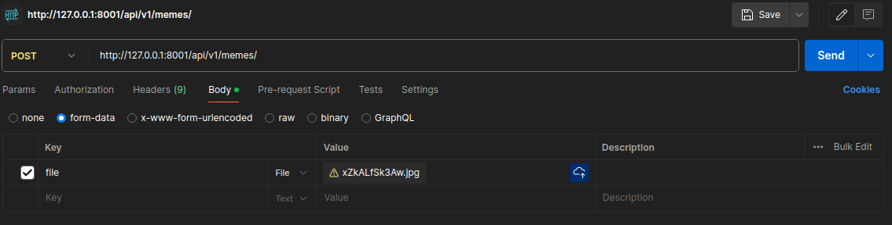

# Тестовое задание для MADSOFT

Приложение представляет собой API для взаимодействия с мемами.

## CRUD-эндпойнты: 

- GET: http://127.0.0.1:8001/api/v1/memes/ - получение списка всех хранящихся мемов
- GET: http://127.0.0.1:8001/api/v1/memes/<meme_id> - получение meme_id-го мема
- POST: http://127.0.0.1:8001/api/v1/memes/ - добавление нового мема
- DELETE: http://127.0.0.1:8001/api/v1/memes/<meme_id> - удаление meme_id-го мема
- PUT: http://127.0.0.1:8001/api/v1/memes/<meme_id> - изменение meme_id-го мема

## Пример добавления нового мема с исп. Postman:

## Инструкция по запуску:

1) Переходим в директорию madsoft-test-task
2) Прописываем docker compose up